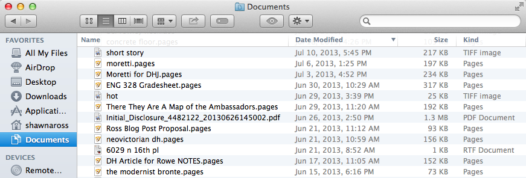

This morning, I received a heart-stopping email from a concerned typesetting editor in charge of the upcoming edited collection, _Henry James Today_ (edited by John Rowe), for which I’ve contributed my essay “Toward a Digital Henry James.”

Figure 4 was blurry. 

Now, Figure 4 was made on a whim about a year ago. I had no intentions then of publishing Figure 4, a scatter plot based on Henry James’s _The Ambassadors_ (1903). It charts the uses of a certain grammatical form (the indexical mode) according to character, page number, and sentence length. I posted it promptly on Facebook to scare my non-academic friends, then moved on to whatever I was actually supposed to be working on at the time.

What a lark, eh? I should have remembered how frequently impulses turn in to projects. (Alternately, I may need new hobbies?)

A few weeks later, when I needed to illustrate one use of quantitative formalism for analyzing James’s late style, I simply popped it in. And ten months later, when my bluff was called the editor requested a 300dpi version of the figure, I cursed Past Self for not particularly going out of my way to save my data, record my process, or even remember which was the original file and which were copies, compressed, or converted. _She’s a smart one, that editor_, I thought. _I can’t buy her off with just resampling the 75dpi image._

Those who saw my Twitter feed earlier today know how I did it:

<blockquote class="twitter-tweet" lang="en">
300dpi chart in 2011 MSOffice: Create chart in Excel. C&amp;P into empty PowerPoint. Print slide as PDF. In Word: Insert&gt;Photo&gt;Picture from File
&mdash; ShawnaRoss (@ShawnaRoss) <a href="https://twitter.com/ShawnaRoss/statuses/478958222980947969">June 17, 2014</a></blockquote>

But that particular solution isn’t the point of this post. And if it were, it would just open a Pandora’s box of helpful tips that would end in me screaming “BUT OFFICE 2011!” The point involves the experience I had hunting down a file that would hopefully contain the scatter-plot points in some kind of form more quickly made machine-readable than reproducing my original search results from the [James concordance](http://victorian.lang.nagoya-u.ac.jp/concordance/james/) hosted by Nagoya University. I hoped I could find the (probably nonsensically named) file containing the data. 

Because probably a good quarter of my files contain “James,” “ambassadors” and/or “indexicals” at this point, a search by date was called for. I had created the image on June 29, 2013, or so the image’s properties said. _Et voilà_: 

As you yourself are probably wishing you could do, I immediately opened “hot.tiff.” It provides screen-capture proof of the record-breaking 119˚ temperature we were suffering under that day. 

A curious thing happened (beyond actually locating inside There They Are A Map of the Ambassadors.pages the necessary data points in a highly convenient .tsv form). A sense of the past, [as James puts it](https://archive.org/details/senseofpastbyhen00jamerich), flooded in as my eyes skimmed the list. On June 29, I was anxious because I was behind on grading (ENG 328 Gradesheet.pages) and upset that our contract for a house had fallen through (Initial_Disclosure.pdf). And because I was working the three different academic projects I was embarking on ([a review of _Distant Reading_](http://www.digitalhumanities.org/dhq/vol/8/1/000171/000171.html), [a blog post for JVC Online](http://myblogs.informa.com/jvc/2013/10/21/you-already-know-how-to-do-this-natively-digital-victorian-studies/), and a never-realized investigation of the modernist biographic tradition centered around the Brontës). But I was also exultant because I, unlike my poor husband, was not running around the heat for meetings in Tempe, but inside our cool apartment, because I was chuffed the indexicals chart looked neat, and because I was enjoying my 23rd-floor view of Central Phoenix, crystal-clear in the dry desert air, with a cold drink in hand.

As my eyes unfocused over the list, I could feel the leather of the club chair on my forearms, the soft crush of the carpet underfoot, the condensation from the glass in my hand, the smooth, unsubstantial heft of my laptop as I set it on the marble side table so I could walk to the windows for an update on the pick-up frisbee game 23 floors below me and one block north. Searching for files I opened on June 29th was my [Proustian madeleine](http://en.wikipedia.org/wiki/In_Search_of_Lost_Time#Memory).

What I found wasn’t just my data: I found a kind of selfie, a photograph of myself in a specific moment taken unconsciously through file extensions and revision dates. However casually constructed, blurry Figure 4 embedded in its metadata a trigger for as many sensory and emotional data-points as it lacked pixels. 

You could possibly object that an unself-conscious selfie isn’t a selfie at all, but insofar as I identify myself with the work I produce --- especially the _files_ I produce, those feathers in a peacock’s tail --- perhaps it wasn’t wholly unconscious. As an academic in search of a tenure-track job, I consider the summer not as an experience in itself, comprised of discrete moments in time, but a stack of blank checks that should cashed in only for new lines on my C.V. But my digital madeleine returned to me that anxious, hopeful, trivial, glorious moment in time that I had, before facing the blurry .tiff, utterly forgotten.