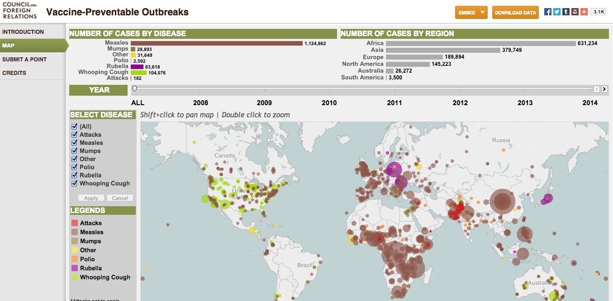
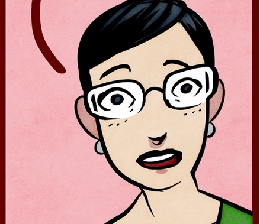
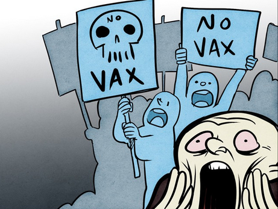
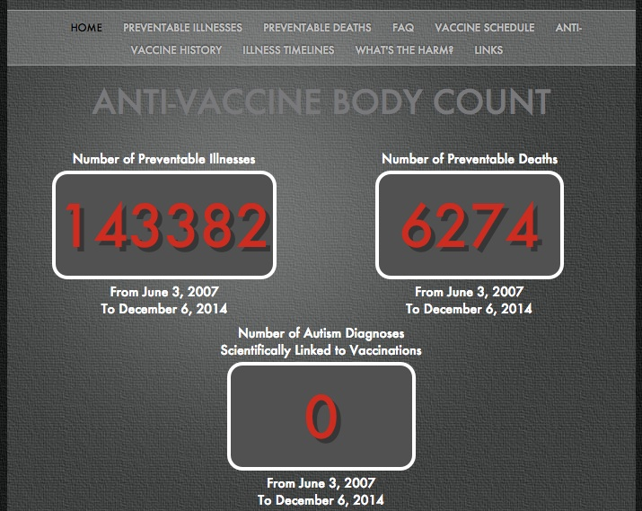

class: middle, center

# Remembering "The Use of Force"

##Anti-Vaxxers, Medical Ethics, and Short Story Syllabi

### _Shawna Ross   Arizona State University_

---

class: middle, center

# Follow at

## @ShawnaRoss   #mla15 #s424

### www.shawnaross.com/   slides/mla2015.html

---

## 45 Short Story Syllabi

## Syllabi without TUoF: 43

* Even though 4 of these used a anthologies including TUoF 

## Syllabi with TUoF: 2
  
* _Course 1_: Durham VA Medical Center, “Literature and Medicine: Humanities at the Heart of Healthcare”
  * Bulgakov, Chekhov, Carver, Coetzee
  
* _Course 2_: General short story survey
  * Assigned two other stories that day, including Ralph Ellison’s "King of the Bingo Game"
	
---

## Does not include TUoF

1. _Norton Anthology of Short Fiction_, Shorter Edition
1. _Norton Anthology of American Literature_
1. _Norton Anthology of World Literature_
1. _Norton Anthology of Western Literature_
1. _Great Short Stories of the Masters_ 
1. _Oxford Book of American Short Stories_ 
1. _The Art of the Tale_
1. _The Best American Short Stories of the Century_
1. _The Art of the Short Story_ 
1. _Longman Anthology of Short Fiction_ 

## Does include TUoF

1. _Norton Anthology of Short Fiction_, Longer Edition
1. _Fiction 100_ (ed. James Pickering)
1. _The Short Story and Its Writer_ 
1. _The Heath Introduction to Fiction_

---

## Vaccines =   human-cow hybrid?

http://io9.com/19th-century-documents-show-how-little-the-anti-vaxxers-1658381223

---

class: center, big, middle

## Harriet Ritvo, _The Animal Estate_

> Especially in the absence of a comprehensive scientific explanation of its transmission and incubation (which was unavailable until the 1880s), ***rabies offered people generous space for rhetorical manipulation***, and they defended that territory against the efforts of experts who struggled vainly during every outbreak to correct their misapprehensions.

---

class: outbreakmap

### Council on Foreign Relations
### Map of Vaccine-Preventable Outbreaks

http://www.cfr.org/interactives/GH_Vaccine_Map/#map

---

class: middle

## "Remembering How to Fight Measles"

### Paul Offit, _The New York Times_

> I remember when I was a boy there was a wall chart in my pediatrician’s office with a title like “Common Rashes of Childhood.” It featured pictures of children with measles, scarlet fever, rubella, chickenpox and roseola. Below each picture was a one-paragraph description of the disease and an explanation of how to tell them apart. It was fascinating. And it gave my mother and me something to read while waiting for the doctor.

> Let’s again use charts like this in schools, waiting rooms and anywhere clinicians, parents and children gather. 

---

## Metropolitan Life Insurance Company Campaign (1910-1)

.center[

]

---

class: middle

## Sexualized

> One of those ***picture children*** often reproduced in advertising leaflets and the photogravure sections of the Sunday papers.

> an ***unusually attractive*** little thing

> I had already fallen ***in love*** with the savage brat.

---

class: center, middle, big

.title-block[
## medical "theatre of proof"
## "not all words are clean"
]

— Hugh Crawford,  
_Medicine, Modernism, and William Carlos Williams_

---

class: center, middle, big

## Bruno Latour, "Why Has Critique Run Out of Steam?
### From Matters of Fact to Matters of Concern"

His mission “to emancipate the public from prematurely naturalized objectified facts” has been deployed in the service of an “illusion of prejudices.” “Dangerous extremists are using the very same argument of social construction [postmodern relativism!] to destroy hard-won evidence that could save our lives.”

---

## Anti-vaxx Has Always Been Rhetorical

> We fear it is not possible for any argument or any form of suasion to stay the tide of folly and ignorance which is now raging against one the most beneficent discoveries ever permitted to man. The chief actors in the anti-vaccination movement are ***men upon whom all statements of fact and argument would be wasted***.

> The platform spouters on this question are beyond our hope, and almost beyond our pity. [...] The arguments which the agitators so boldly state are very specious; they refer to matters concerning which their hearers have no real experience; and they seem to be ***supported by a certain class of facts.***

- _British Medical Journal_, 1869

---

class: middle

## Concepts from Latour

* Civil war versus policing
* "stubbornly realist attitude"
* From matters of fact to matters of concern

## Link to Williams

* Short stories are “a good medium for nailing down a single conviction. Emotionally."

---

## Deference

> the mother, a big startled looking woman, very clean and apologetic

> You must excuse us, doctor

> Such a ***nice man***

> do what he tells you to

> almost turned themselves inside out in embarrassment and apology

> The ***nice man***

> ***For heaven's sake, I broke in. Don't call me a nice man to her. I'm here to look at her throat on the chance that she might have diphtheria and possibly die of it.***

---

## They Are at War

> Then I grasped the child's head with my left hand and tried to get the wooden tongue depressor between her teeth. She fought, with clenched teeth, desperately! But now I also had grown furious—at a child. ***I tried to hold myself down but I couldn't.*** I know how to expose a throat for inspection. And I did my best. When finally I got the wooden spatula behind the last teeth and just the point of it into the mouth cavity, she opened up for an instant but before I could see anything she came down again and gripping the wooden blade between her molars she reduced it to splinters [....]

> I have seen at least two children lying dead in bed of neglect in such cases, and feeling that I must get a diagnosis now or never I went at it again. But the worst of it was that ***I too had got beyond reason.*** I could have torn the child apart in my own fury and enjoyed it. ***It was a pleasure to attack her.***

---

## For Our Protection

> The damned little brat must be ***protected against her own idiocy***, one says to one's self at such times. Others must be protected against her. It is a social necessity. And all ***these things are true***. But a blind fury, a feeling of adult shame, bred of a longing for muscular release are the operatives. One goes on to the end.

> In a final unreasoning assault I overpowered the child's neck and jaws. I forced the heavy silver spoon back of her teeth and down her throat till she gagged. And there it was-both tonsils covered with membrane. She had fought valiantly to keep me from knowing her secret. ***She had been hiding*** that sore throat for three days at least and ***lying*** to her parents in order to escape just such an outcome as this.

> Now truly she was furious. She had been on the defensive before but now she attacked. Tried to get off her father's lap and fly at me while tears of defeat blinded her eyes.

---

class: middle

## Rhetorical & Physical War

> Put her in front of you on your lap, I ordered, and hold both her wrists.

> But as soon as he did the child let out a scream. Don't, you're hurting me. Let go of my hands. Let them go I tell you. Then she shrieked terrifyingly, hysterically. Stop it! Stop it! You're killing me!

> Do you think she can stand it, doctor! said the mother.

> You get out, said the husband to his wife. Do you want her to die of diphtheria?

---

class: center, middle, big

Instead, Latour advises us “to reconnect scientific objects with their aura…their web of associations” because matters of fact “are a poor proxy of experience.” This is why McCarthy’s sentimental narratives do more cultural work than some scientific studies. 

---

class: middle 
## Back to Jenny McCarthy

### _Chicago Sun-Times_

* "Again I ask, what happened to critical thinking?"

* "One size does not fit all. God help us if gray is no longer an option.""

---

class: middle

### Elena Conis, _Vaccine Nation_

> In media reports that covered the vaccine-autism link, scientists quoted facts and figures about the very “real” risk of vaccine-preventable diseases, and the minuscule or non-existent risks of vaccines themselves. Parents described the risks they most feared—-autism, not polio; toxic chemicals, not diphtheria. 

### _The New Yorker_

> McCarthy doesn’t care; for her, facts are just another point of view. 

---

class: middle

### Critics

* "...incredibly, a former Playmate" (_The New Republic_)

* "anyone can attend what McCarthy calls the 'University of Google'" (_Wired_)

* "witchcraft is make-believe, as is your anti-vaccine nonsense" (_Time_)

* "former MTV star Kristin Cavallari plugged the anti-vaccination cause, citing “books” and “studies.”
" (_New York Post_)

---
class: mccarthy
# Admittedly, Jenny McCarthy ≠ Mathilda

.center[

http://www.thedailybeast.com/articles/2014/04/16/jenny-mccarthy-says-she-s-never-been-anti-vaccine-yeah-right.html
]

---

class: middle, center

### Portrait of a Pro-Vaxxer

https://medium.com/the-nib/vaccines-work-here-are-the-facts-5de3d0f9ffd0

---

class: middle, center

### Portrait of an Anti-Vaxxer

https://medium.com/the-nib/vaccines-work-here-are-the-facts-5de3d0f9ffd0

---
class: bodycount
### Instead of Jenny McCarthy Body Count...

.center[

]

---

class: middle

## "The shock is necessary..."

### "A Beginning on the Short Story" (1950)

> looking back upon it, what were the elements involved in my coming upon the short story as a means?—-that is during The Depression?... I lived among these people. I knew them and saw the essential qualities, (not stereotype) the courage, the humor (an accident) the deformity, the basic tragedy of their lives—-and the importance of it.... Why the short story? Not for a sales article but as I had conceived them. The briefness of their chronicles, its brokenness and hereogeneity-—isolation, color.

---

class: middle, center, big

## Direct treatment of the thing?

I tried to hold myself down but I couldn't.

I too had got beyond reason.

It was a pleasure to attack her.

The little brat must be protected against her own idiocy.

